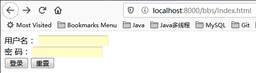
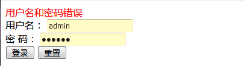
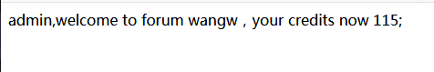

## 论坛登录系统

This is a simple forum system built by SSM[简易论坛登录]

### 项目说明
|   持久层   |   业务层   |  展现层  |  Web服务器  |
|   :----:     |    :----:    |   :----:   |   :--------------:  |
|  JDBC  |  Spring声明式事务  |  Spring MVC  |  Tomcat  |

### Change log
- 2020/01/15 Spring Boot的初级版本(未使用MyBatis)

### 运行截图
- 初始登录页面：

- 登录失败页面：

- 登录成功页面：

